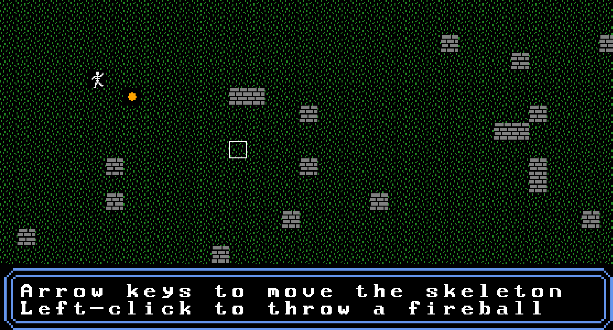

# Asterion Engine
A cross-platform OpenGL4 1-bit tilemap engine similar to the one used by the first Ultima games, written in C# (.NET Framework 4.5) with OpenTK. Released under the GNU General Public License.

- **Don't forget to add a NuGet reference to OpenTK 3.2 in the AsterionEngine project**

## Features
- Similar structure to the OpenTK GameWindow class, just override the OnLoad/OnUpdate methods and you're set
- Handles keyboard and gampad input events
- Virtual "tile board" of customizable size with any number of tiles
- Handles animated tiles and special effects (projectiles, explosions...)
- Frame animation computed in the GLSL shader by using each of the R,G,B channel as a different frame
- Can load tiles from up to 4 tilemaps, each as large as the video memory can store
- Can play way files (requires OpenAL32.dll in the assembly directory)
- Data (sounds, tilemaps, etc) can be loaded from files or .NET Framework classes such as Image and Bitmap, but also from encrypted archives, which can be created and loaded with the FileSourceArchive class
- Handles all OpenTK/OpenGL/OpenAL calls internally, you *don't* have to add a reference to OpenTK or even System.Drawing in your game, just to AsterionEngine.dll
- Ultra-fast (no immediate mode OpenGL calls, only vertex buffers)
- Includes WinForms tools to easily create tilemaps, animations and archives
- Demo project included

